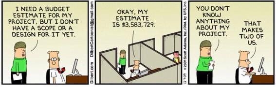
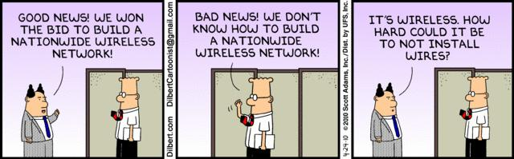
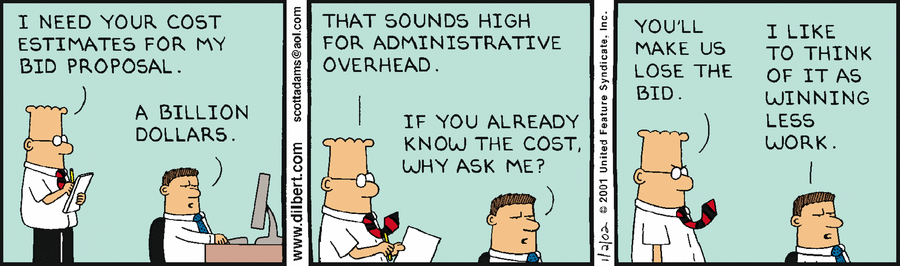
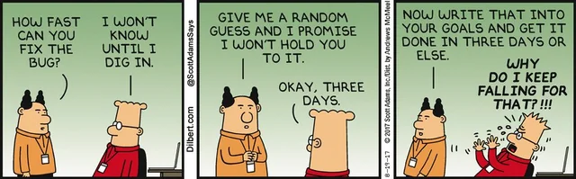

## Scope and Estimates

Defining project scope and making accurate estimates are two of the biggest challenges in engineering and project management. Scope sets the boundaries for what will be delivered, while estimates help teams plan resources, schedules, and budgets. Misunderstandings or changes in scope can lead to missed deadlines, cost overruns, and frustration for everyone involved.

The Dilbert comics below humorously illustrate common pitfalls and misunderstandings in scope definition and estimation—reminding us that clear communication and realistic planning are essential for project success.

---

{: .highlight }
**Disclaimer:** AI is used for text summarization, explaining and formatting. Authors have verified all facts and claims. In case of an error, feel free to file an issue or fix with a pull request.
