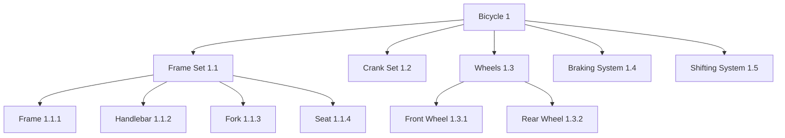
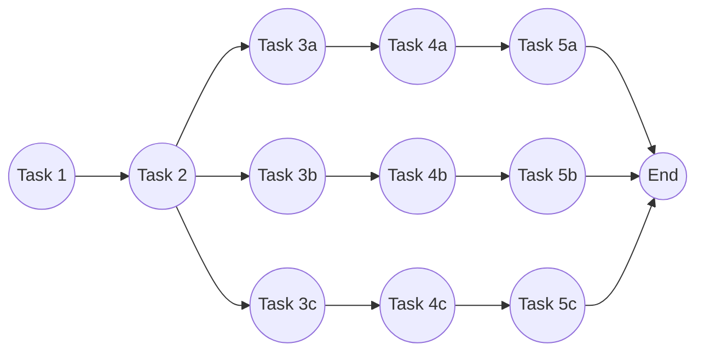
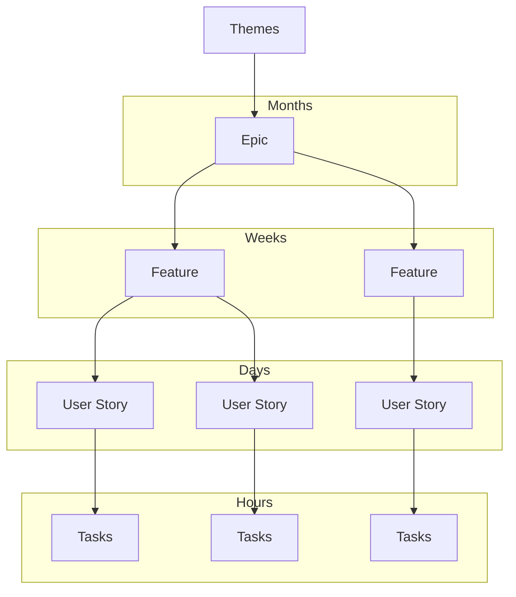

## Work Breakdown Structure (WBS) - Introduction

_* adapted from Miranda, 2014_

A **Work Breakdown Structure (WBS)** is a fundamental project management technique used to decompose the total scope of work into smaller, more manageable components. According to NASA’s Systems Engineering Handbook, the WBS serves as both a **planning tool** and a **framework for integration and control** throughout the project lifecycle. It provides a structured way to capture **what needs to be delivered** (outcomes) and **what work must be performed** to achieve those outcomes.

### Definition and Purpose

- The WBS is a **hierarchical decomposition** of the project’s deliverables and associated work.
    
- It can be presented in **graphical form** (tree diagrams) or **textual form** (outline numbering).
    
- It ensures that **all work is identified**, planned, and assigned, leaving no ambiguity about project scope.
    

For example, building a bicycle can be represented as a WBS in graphical form:



Or in textual outline form:

```text
1. Bicycle  
   1.1 Frame Set  
       1.1.1 Frame  
       1.1.2 Handlebar  
       1.1.3 Fork  
       1.1.4 Seat  
   1.2 Crank Set  
   1.3 Wheels  
       1.3.1 Front Wheel  
       1.3.2 Rear Wheel  
   1.4 Braking System  
```

### Why WBS is Important

- **Scope clarity:** The WBS clearly defines **what is inside the project** and excludes what is not. NASA emphasizes the _cardinal rule_: _If it’s not in the WBS, it’s not part of the project._
    
- **Integration of management:** It serves as the backbone for **scheduling, cost estimation, risk management, configuration management, and performance tracking**.
    
- **Communication tool:** It highlights the project’s deliverables for both **stakeholders** and the **project team**, ensuring a shared understanding of objectives.
    
- **Resilience:** A good WBS evolves as the project progresses, incorporating refinements as knowledge increases.
    

### Characteristics of a Good WBS

- Identifies **all project outcomes** and the **work required** to achieve them.
    
- Ensures that at every level, the sum of the child elements equals 100% of the parent’s scope (the **100% rule**).
    
- Encourages validation by including even uncertain elements (_“If in doubt, include it—let the customer confirm or discard it”_).
    
- Represents deliverables and supporting work, not just a list of sequential tasks.
    

### What is NOT a Good WBS

A poor WBS is one that merely lists activities in a **process flow** without structuring deliverables. For instance, from (Tsui&Karam):



This depicts a schedule, not a WBS. Unlike a process chain, a true WBS emphasizes _what must be produced_ and _what work enables it_, not simply the order of tasks.

### Agile Perspective

In Agile contexts, the WBS adapts to iterative delivery. A hierarchy may be built from **Themes → Epics → Features → User Stories → Tasks**, aligned with planning horizons:



---

In short, the **WBS is not just a breakdown of tasks—it is the foundation of project definition, control, and success**. NASA treats it as a living structure that evolves with the project and ensures complete alignment of work, deliverables, and outcomes.

---

## Acknowledgments

This content is heavily inspired by and adapted from lectures by **Eduardo Miranda** and **David Root** on software project management. The structure, examples, and pedagogical approach reflect their teaching materials and frameworks.

---

## Sources

- NASA Systems Engineering Handbook (2007).
- Essentials of Software Engineering, 3rd Ed., F. Tsui & O. Karam, 2022.
- K. Rubin, _Essential Scrum: A Practical Guide to the Most Popular Agile Process_, 2012.
- Miranda, Eduardo. *Managing Software Development*. Lecture materials, 2014.

---

{: .highlight }
**Disclaimer:** AI is used for text summarization, explaining and formatting. Authors have verified all facts and claims. In case of an error, feel free to file an issue or fix with a pull request.
