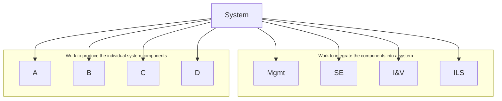

# NASA Work Breakdown Structure (WBS) Method

## 1. What is a WBS?

- **Definition**: A Work Breakdown Structure (WBS) is a **hierarchical decomposition** of all work required to accomplish a project’s objectives.
- **Focus**: NASA stresses a **product-based WBS**, meaning it breaks down deliverables (hardware, software, services) rather than functions or activities.
- **Goal**: Provide a logical, consistent framework for planning, budgeting, scheduling, and tracking project progress.

---

## 2. Relationship to Other Structures

- **PBS (Product Breakdown Structure)**: Shows _what_ products are needed.
- **WBS**: Adds the _work to create, integrate, and manage_ those products (e.g., systems engineering, integration & verification, logistics, management).
- **Key idea**:  
    _PBS = system components_  
    _WBS = PBS + work needed to realize/integrate them_

---

## 3. Role of WBS in NASA Projects

- **Organizing backbone** for:
    - Technical planning and scheduling
    - Cost estimation and earned value management (EVM)
    - Defining scope of Statements of Work (SOW) and contracts
    - Status reporting (cost, schedule, performance)
    - Documentation (SEMP, specifications, drawings)
- Provides a **shared vocabulary** across NASA, contractors, and stakeholders.

---

## 4. WBS Levels & Hierarchy

- **Top level**: Project’s prime product(s) (e.g., spacecraft, payload, ground system).
- **Mid levels**: Subsystems, segments, and enabling elements.
- **Lowest level**: Tangible items (hardware, software, documents) with a responsible engineer/manager.
- Each element:
    - Has a **WBS code** (numbering system)
    - Is described in a **WBS dictionary** (title, objective, description, dependencies).

---

## 5. Development Techniques

- **Top-down iterative process**:
    1. Define system architecture → preliminary PBS.
    2. Add required services (management, I&V, SE, logistics).
    3. Decompose recursively until reaching cost account level.
- **Involve responsible engineers** for lower-level elements to ensure completeness.
- **Alternative**: Build complete PBS in one design step, then expand into WBS (risk: missing items).

---

## 6. Common Errors to Avoid

1. **Functions, not products**
    - Wrong: “Design, Fabrication, Test”
    - Right: “Spacecraft Bus, Payload, Ground Station”
2. **Branching inconsistent with integration**
    - Wrong: Separating hardware and software when they integrate at subsystem level.
3. **WBS inconsistent with PBS**
    - Leads to gaps in implementation and mismanagement.

---

## 7. Life-Cycle Use of WBS

- Used **throughout all project phases**:
    - Early: conceptual framework for objectives & scope.
    - Mid: refined with detailed subsystems, cost accounts, and work packages.
    - Later: updated continuously to track changes in scope, cost, and risk.
- **Baseline WBS** becomes part of program plan and is controlled/configured like any other project artifact.

---

## 8. NASA Standard WBS (per NPR 7120.5)

- NASA mandates a **standardized high-level WBS** for spaceflight projects:
    - Includes prime products (payload, spacecraft, ground systems).
    - Includes enabling/support products (management, systems engineering, safety, mission ops, education).
- Ensures **consistency** with NASA accounting, acquisition, and reporting systems.

---

## 9. Integration with Other Processes

- **Systems Engineering**: Ensures WBS reflects architecture and traceability.
- **Cost & Schedule Management**: WBS ties directly into EVM (Budgeted Cost of Work Scheduled, Earned Value).
- **Risk Management**: WBS granularity adapted to risk (high-risk items → detailed WBS).
- **Configuration Management**: WBS and dictionary under formal control, updated as project evolves.

---

## 10. Key Takeaways / Review

- WBS is **product-based**, not function-based.
- Combines **PBS + enabling services**.
- Provides **structure for cost, schedule, and technical integration**.
- Must be **kept consistent** with PBS and updated through life cycle.
- Avoids pitfalls by:
    - Keeping product focus.
    - Aligning with integration strategy.
    - Ensuring completeness.

---

## Sources

1. NASA Systems Engineering Handbook (2007).
2. Sadler, Christopher Lewis. "NASA work breakdown structure (WBS) handbook." (2021).

---

{: .highlight }
**Disclaimer:** AI is used for text summarization, explaining and formatting. Authors have verified all facts and claims. In case of an error, feel free to file an issue or fix with a pull request.