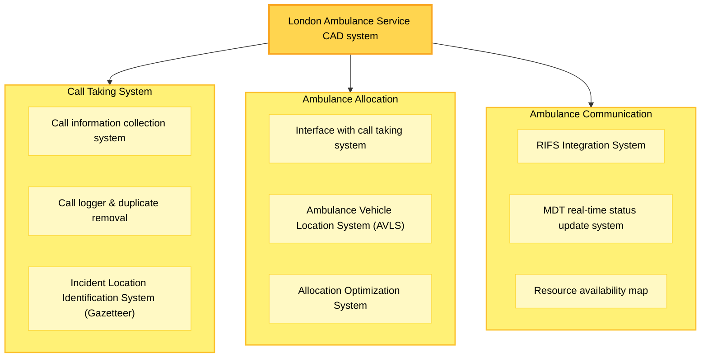
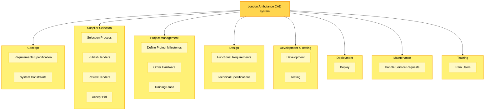
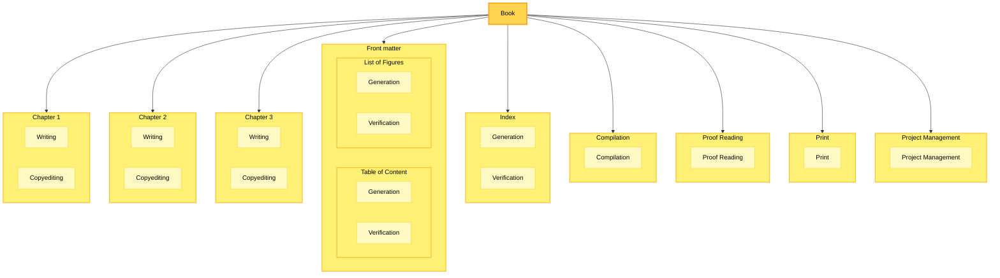
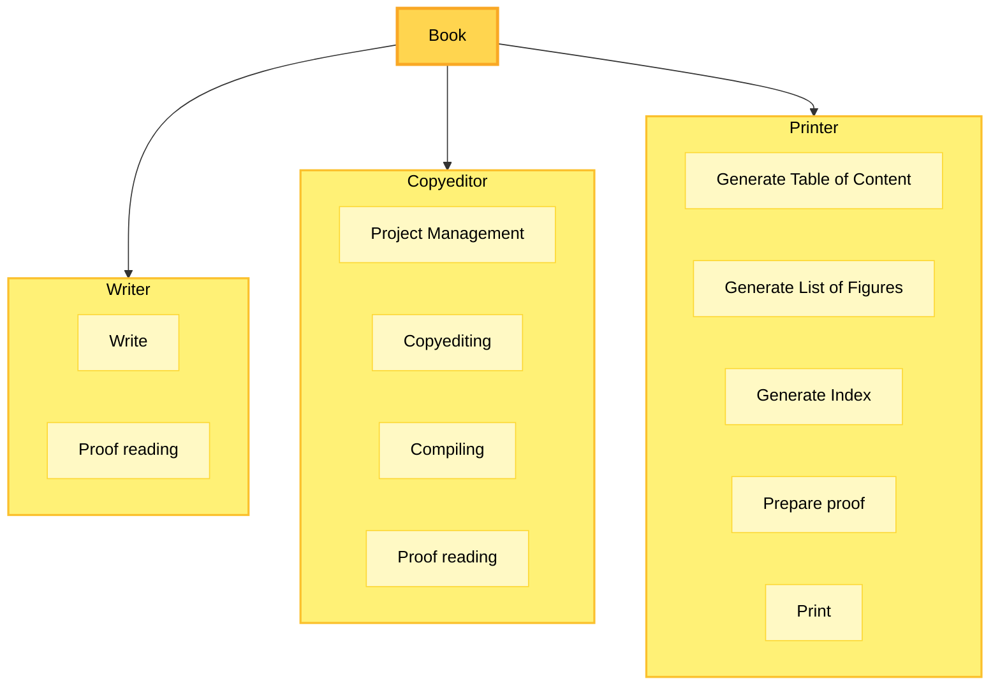
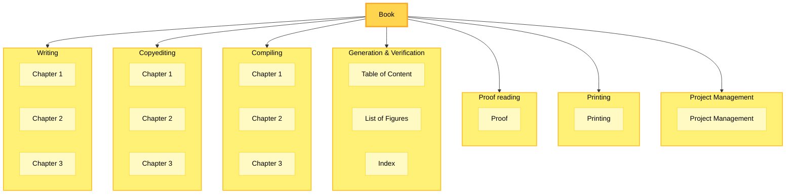

# WBS Orientation

## 1) Why orientation matters

**Orientation** = the rule you use to break work down.  
Pick one main rule and apply it consistently; it shapes what people “see” when they read your WBS.

- **Sponsor view (outcomes):** “What am I getting?”
- **Delivery team view (tasks/phases or disciplines):** “How will we do it?”
- **Finance view (accounts):** “How will we budget/track it?”  
  Often you’ll use a **hybrid** (e.g., outcomes at Level 2, then tasks underneath).

---

## 2) Compare your two LAS CAD WBSs

- **Diagram A (Call Taking / Allocation / Communication):**  
  **Outcome / product-oriented.** It decomposes by **delivered subsystems/services**.  
  Best for sponsors and scope conversations: boundaries and acceptance are visible.

- **Diagram B (Concept → Supplier Selection → PM → Design → Dev&Test → Deployment → Maintenance → Training):**  
  **Task/phase-oriented.** It decomposes by **how you’ll execute**.  
  Best for demonstrating delivery approach, schedule planning, and staffing.

**Answers to your questions**

- _Which presents outcomes and focuses on Sponsor needs?_ **Diagram A (Outcome-oriented).**
- _Which shows you know how to do the system (your know-how)?_ **Diagram B (Task/phase-oriented).**

---

## 3) The main orientations (with quick cues)

| Orientation                   | How it breaks down                | Great for                    | Watch out for                                 |
|-------------------------------|-----------------------------------|------------------------------|-----------------------------------------------|
| **Outcome / Deliverable / Product** | Features, subsystems, documents, releases | Sponsor alignment, scope control, acceptance criteria | You must still show when/how work happens (use a crosswalk to schedule) |
| **Task / Phase**              | Concept, Design, Build, Test, Deploy, etc. | Process clarity, scheduling, resource loading | Can hide scope (what exactly is delivered?)   |
| **Discipline / Functional**   | Teams or skills: Analysis, UX, Backend, QA, Ops | Org staffing, cost centers, responsibility | Can obscure end-to-end deliverables           |
| **Accounting**                | Chart of accounts, cost buckets   | Budgeting, reporting         | Not helpful for scope or execution nuance      |
| **Hybrid**                    | e.g., Level 2 outcomes → Level 3 tasks | Balancing audiences          | Be consistent and avoid mixing rules at the same level |

> **Rule of thumb:** Use **outcomes** for Level 2 when negotiating scope with sponsors; use **tasks/phases** one level below for planning the work.

---

## 4) The Book project—seeing orientations

- **Outcome-oriented (your first Book WBS):** top level = chapters, front matter, index, compilation, proof reading, print, PM.  
  Sponsor can count deliverables (e.g., “3 chapters + ToC + LoF + Index”). Scope changes (add chapter) are easy to reason about.

- **Discipline-oriented (Writer / Copyeditor / Printer):** clarifies **who** does **what**, helpful for staffing and contracts.

- **Task-oriented (Writing / Copyediting / Compiling / Gen&Verify / Proof / Printing / PM):** shows the **process** pipeline; good for schedule and dependencies.

---

## 5) Which WBS answers which questions fast?

| Scenario / Question                           | Outcome-oriented | Discipline-oriented | Task/phase-oriented |
|-----------------------------------------------|------------------|--------------------|---------------------|
| **How many chapters?**                        | **Easy**         | Hard               | Medium              |
| **Who does copyediting?**                     | Medium           | **Easy**           | Medium              |
| **Drop Chapter 2 – impact on total cost?**    | **Easy**         | Medium             | Medium              |
| **Which chapter is more expensive (2 vs 3)?** | **Easy**         | Medium             | Medium              |
| **Add a new chapter – what changes?**         | **Easy**         | Medium             | Medium              |
| **Chapter 3 has heavy illustrations – where does that work live?** | Medium | **Easy** | Medium |

> Takeaway: **Outcome orientation best answers scope & sponsor questions.**  
> **Discipline** best answers staffing/ownership.  
> **Task/phase** best answers “how/when” planning.

---

## 6) Choosing an orientation (quick decision guide)

1. **Primary audience = Sponsor?** Choose **Outcome** (Level 2).
2. **Primary risk = execution complexity?** Add **Task/phase** at the next level.
3. **Tight org boundaries or vendors?** Add a **Discipline** layer (but not at the same level as outcomes).
4. **Heavy finance reporting?** Mirror the **Chart of Accounts** one level down or via codes.

---

## 7) Quality rules for any WBS

- **100% Rule:** Children fully cover (and only cover) the parent’s scope.
- **Mutual exclusivity:** No overlaps between siblings.
- **Consistent grammar with orientation:**
    - Outcomes: noun-heavy (“Chapter 2”, “Index”).
    - Tasks: verb-noun (“Generate Index”).
    - Discipline: team/object (“Copyediting”, “Printing”).
- **Coding & traceability:** Use numbering (1.2.3) and keep a **crosswalk** (Outcome ↔ Phase ↔ Discipline ↔ Account) so you can pivot without rebuilding the WBS.

---

## 8) Communicating with orientation

- For **sponsors**: show the **Outcome WBS** plus a milestone view.
- For **engineers**: attach the **Task/phase breakdown** under each deliverable.
- For **management/finance**: tag work packages with **discipline** and **account codes**.

---

## 9) Resilience to change

When scope changes (e.g., “Add Chapter 4” or “Color figures in Chapter 3”):

1. Add/modify the **outcome** node.
2. In the crosswalk, link it to the impacted **tasks**, **disciplines**, and **accounts**.
3. Costs/schedule roll up cleanly—no need to re-organize the entire tree.

---

### One-minute recap

- **Orientation = the organizing rule.**
- **Outcome** shows _what you deliver_ (sponsor-first).
- **Task/phase** shows _how you deliver_ (planner-first).
- **Discipline** shows _who delivers_ (org-first).
- Use a **hybrid** thoughtfully and keep a **crosswalk**.

---

### Quick check (one question)

Looking back at your **LAS CAD** diagrams, which would you show first to a **funding sponsor deciding scope**—Diagram A or Diagram B—and why?

---

{: .highlight }
**Disclaimer:** AI is used for text summarization, explaining and formatting. Authors have verified all facts and claims. In case of an error, feel free to file an issue or fix with a pull request.