```mermaid
graph TD
  %% Root Deliverable
  P["Project Deliverables"]

  %% Major Deliverables
  P --> D1["1.0 Project Management"]
  P --> D2["2.0 Design & Development"]
  P --> D3["3.0 Implementation"]
  P --> D4["4.0 Testing & Verification"]
  P --> D5["5.0 Deployment & Closure"]

  %% Sub-deliverables under Project Management
  D1 --> D1_1["1.1 Planning"]
  D1 --> D1_2["1.2 Monitoring & Control"]
  D1 --> D1_3["1.3 Reporting"]

  %% Sub-deliverables under Design & Development
  D2 --> D2_1["2.1 Requirements Analysis"]
  D2 --> D2_2["2.2 System Design"]
  D2 --> D2_3["2.3 Prototypes"]

  %% Sub-deliverables under Implementation
  D3 --> D3_1["3.1 Software/Hardware Build"]
  D3 --> D3_2["3.2 Integration"]
  D3 --> D3_3["3.3 Documentation"]

  %% Sub-deliverables under Testing & Verification
  D4 --> D4_1["4.1 Unit Testing"]
  D4 --> D4_2["4.2 System Testing"]
  D4 --> D4_3["4.3 Acceptance Testing"]

  %% Sub-deliverables under Deployment & Closure
  D5 --> D5_1["5.1 Training & Handover"]
  D5 --> D5_2["5.2 Deployment"]
  D5 --> D5_3["5.3 Project Closure"]

  %% Work Packages Example
  D2_2 --> WP1["2.2.1 High-Level Design Document"]
  D2_2 --> WP2["2.2.2 Detailed Design Document"]
  D3_1 --> WP3["3.1.1 Software Module A"]
  D3_1 --> WP4["3.1.2 Software Module B"]
```

# PMI Work Breakdown Structure (WBS)

## 1. Definition and Concept

- **WBS (Work Breakdown Structure):**
    > A **deliverable-oriented hierarchical decomposition** of the project scope that organizes and defines the total work to be completed.
- Each level of the WBS provides an increasingly detailed definition of the project work.
- Purpose: Divide large, complex projects into **manageable components** (“bite-sized pieces”).

### Key Features

- Hierarchical structure.
- Focused on **deliverables**, not just tasks.
- Each WBS element represents a **tangible outcome** (not just effort).
- Lowest level: **Work Package**, which can be scheduled, budgeted, and assigned.

---

## 2. Objectives of the WBS

- Provide **clarity** on what is included in project scope.
- Support **planning, scheduling, and budgeting**.
- Ensure **accountability** by linking deliverables to responsible units.
- Create a **framework for communication** and **progress reporting**.

---

## 3. Why Use a WBS? (Benefits)

- **Communication tool:** Clarifies project scope and deliverables for stakeholders.
- **Reporting framework:** Allows reporting by life-cycle phase, deliverable, or work package.
- **Integration:** Links scope, schedule, cost, and risk into one structure.
- **Control:** Helps track progress, performance, and resource allocation.
- **Risk management:** By decomposition, high-risk areas are identified early.

---

## 4. How to Create a WBS

### General Process

1. **Identify final deliverables** (review scope docs, SOW, requirements).
2. **Define major deliverables** (e.g., design documents, subsystems).
3. **Decompose deliverables** into smaller, manageable components.
4. **Refine until stakeholders agree** scope and planning are sufficient.

### Guidelines for Preparation

- **Think deliverables, not activities.**
- **Think with the end in mind.**
- Review: “How do the pieces fit together?” → “How does one eat an elephant? One bite at a time.”

### Factors to Consider

- Each element should represent a **single tangible deliverable**.
- Each child element belongs to **only one parent** (no overlaps).
- Completeness: all project work must be represented.

---

## 5. Measurement & Control

- WBS links to cost, schedule, and performance to create a **Performance Baseline**.
- Enables integrated analysis of **cost + schedule + scope**.
- Work must be:
    - **Estimated**
    - **Resourced**
    - **Scheduled**
    - **Budgeted**
    - **Controlled**

---

## 6. Challenges

- **Balancing detail vs. usability:** Too much decomposition → excessive maintenance.
- **Defining logical relationships:** Must align with project dependencies.
- **Avoid skipping WBS:** Jumping directly to scheduling tools (e.g., Gantt charts) risks overlooking deliverables.

---

## 7. Life-Cycle and Risk Considerations

- WBS evolves with project phases (rolling-wave planning).
- Complex projects require deeper decomposition.
- WBS aids **risk identification**:
    - Links risk to deliverables.
    - Highlights high-risk areas needing detail.
    - Supports assumption validation and contingency planning.

---

## 8. Resource Planning

- WBS integrates with **Organizational Breakdown Structure (OBS)** and **Responsibility Assignment Matrix (RAM)** to assign ownership.
- Facilitates workload distribution and accountability.

---

## 9. Industry Examples

PMI provides **11 WBS examples** for domains such as Oil & Gas, Environmental Management, Process Improvement, Pharmaceuticals, Telecom, Web Design, Government, and Software Implementation.  
Demonstrates adaptability of WBS across industries.

---

## 10. Summary (PMI View)

- WBS is **the backbone of project planning and control**.
- **Deliverable-based decomposition** ensures clarity, accountability, and integration.
- Serves as the foundation for **scope definition, scheduling, budgeting, risk management, and reporting**.
- Must balance **detail vs. practicality**, and evolve with the project life cycle.

---

---

## Source

Woodward, H. "Project Management Institute practice standard for work breakdown structures. 2001, Newton Square: Project Management Institute."

---

{: .highlight }
**Disclaimer:** AI is used for text summarization, explaining and formatting. Authors have verified all facts and claims. In case of an error, feel free to file an issue or fix with a pull request.
