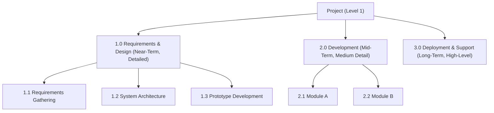

# Planning Waves (PMI)

## 1. Work Breakdown Structure (WBS) Recap

- **Definition:**  
    A **deliverable-oriented hierarchical decomposition** of project scope into smaller, manageable elements.  
    ➝ Goal: Ensure **all work is captured** and **no unnecessary work is included**.

- **Structure:**
    - **Level 1:** Project / Final Deliverable
    - **Level 2:** Major Deliverables or Phases
    - **Level 3+:** Sub-deliverables → Work Packages
    - **Lowest Level:** Work Package = tangible, schedulable, assignable unit.

- **Functions:**
    - Provides framework for **scope definition, scheduling, cost estimating, risk management, and reporting**.
    - Enables **progressive decomposition**—breaking work down “one bite at a time.”

---

## 2. Planning Waves (Rolling Wave Planning)

- **Definition:**  
    A **progressive elaboration technique** where near-term work is planned in detail, while future work is kept at a higher level until closer in time.
    - **Short-term:** Detailed WBS decomposition.
    - **Long-term:** High-level WBS placeholders refined later.

- **Why use planning waves?**
    - Large or long-duration projects cannot be fully detailed at the start.
    - Helps manage **uncertainty** and **complexity**.
    - Balances **flexibility** with **control**.
    - Allows project managers to adapt as more information becomes available.

---

## 3. WBS Life-Cycle Considerations

- **Level of Detail Depends On:**
    - Project size and complexity.
    - Risks associated with deliverables.
    - Project manager’s need for control.

- **Different Levels Across Project:**
    - Some parts of WBS may be highly detailed (near-term work).
    - Other parts remain summarized (future work, pending clarity).

- **Short-duration projects:**
    - Full decomposition possible upfront.

- **Long-duration projects:**
    - Decomposition delayed for some deliverables until later in the life cycle.

---

## 4. Risk and Planning Waves

- **WBS and Risk Management:**
    - High-risk areas → need **greater detail early** (better assumptions, estimates, and control).
    - WBS supports linking risks to specific deliverables for **targeted mitigation**.

- **Rolling Wave + Risk:**
    - Allows project managers to refine scope in risky areas when more data is available.
    - Reduces waste from over-planning uncertain tasks.

---

## 5. Practical Guidelines

When creating WBS with planning waves in mind:

1. **Start high-level:** Identify the final deliverables.
2. **Detail near-term work:** Break down immediate phases into work packages.
3. **Leave future work flexible:** Keep as high-level placeholders until execution nears.
4. **Iteratively refine:** Update decomposition as scope, risk, and requirements become clearer.
5. **Balance detail vs usability:** Too much detail = overhead; too little = loss of control.

---

## 6. Example – Rolling Wave WBS

Imagine a **3-year IT program**:

- **Near-term (Year 1):**
    - Detailed work packages for requirements gathering, architecture, prototypes.
- **Mid-term (Year 2):**
    - High-level WBS entries like “System Development” → later decomposed into module builds.
- **Long-term (Year 3):**
    - Placeholder “Deployment & Support” → later detailed into training, rollout, stabilization.

---

**Summary:**

- The **WBS is the backbone** of project planning and integrates scope, cost, schedule, and risk.
- **Planning waves (rolling wave planning)** recognize that not all future work can be fully decomposed at the start.
- Near-term = detailed, future = high-level, refined later.
- This approach increases adaptability, reduces planning waste, and helps manage **uncertainty in complex, long-duration projects**.

## Source

Woodward, H. "Project Management Institute practice standard for work breakdown structures. 2001, Newton Square: Project Management Institute."

---

{: .highlight }
**Disclaimer:** AI is used for text summarization, explaining and formatting. Authors have verified all facts and claims. In case of an error, feel free to file an issue or fix with a pull request.
