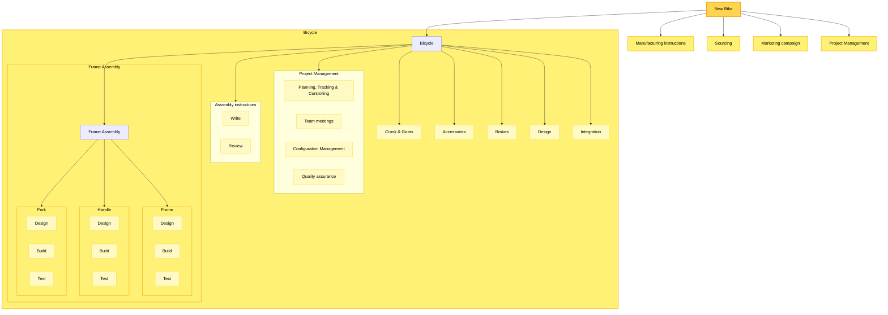

# WBS Building Process

## What is a WBS (in one line)

A **Work Breakdown Structure** is a hierarchical decomposition of the **project’s outcomes** and the **work needed to produce them**, organized with a **consistent orientation** (rule for breaking things down).

---

## What counts as a “project outcome”

Use these as legal “things” at the top levels of a WBS:

- **Products** – tangible deliverables (documents, software, hardware)
- **Services** – activities performed to satisfy a need (e.g., training, database migration, CMMI assessment)
- **Processes** – instructions/procedures (e.g., installation guide, business process)
- **Capabilities** – abilities the organization gains (e.g., “can operate the new system”, “reduced cycle time”)

**Activities vs Tasks**

- **Activity** = a _heterogeneous_ bundle of tasks with a common purpose (e.g., “Design subsystem”, “Test integration”)
- **Task** = _homogeneous_ work (e.g., “Create schema”, “Write test cases”)

---

## Example

**Interpreting the example**

- **Outcomes:**  
    - _Product_ → **Bicycle** (and its subsystems)
    - _Process_ → **Manufacturing instructions**
    - _Capability_ → **Sourcing**
    - _Service_ → **Marketing campaign**
- **Activity → Tasks:**  
    _Project Management_ (activity) contains tasks like _Configuration Management_, _Quality Assurance_, etc.
- **Work package** = _Outcome or Activity_ **plus** the tasks to realize it (e.g., “Fork → Design, Build, Test”)

---

## Rolling Wave & Packages

> Plan what you know now; detail the near wave; keep future waves coarse.

- **Work packages**
    - Smallest agreed unit for estimating/scheduling
    - One clear **outcome**, explicit tasks, one **owner**
- **Planning packages**
    - Placeholders for later decomposition; have a purpose and tentative dates
    - Convert to work packages as information becomes available  
      _Source:_ Githens (1998), _Rolling Wave Project Planning_

---

## Prerequisites (what you must know or assume—and write down)

- **Start & end** of the project; deployment responsibility (single/multi-site)
- **Requirements** (or plan to elicit): purpose, stakeholders, functions, interfaces
- **Quality attributes** (performance, security, modifiability, reliability, usability) that might create new tasks
- **Notional architecture** (DBs, services, GUIs, servers, middleware; make/buy/reuse)
- **Execution approach** (“how to” at a high level: phases/activities)

---

## The WBS-Building Process (10 focused steps)

1. **Frame the scope**  
    Draft a scope statement and list stakeholders, constraints, and assumptions.
2. **Choose an orientation for Level-2**  
    Prefer **Outcome-oriented** for sponsor discussions. (You can mix later levels, but one rule per level.)
3. **List outcomes** (products, services, processes, capabilities)  
    Use the **100% Rule**: siblings collectively and uniquely cover the parent.
4. **Sketch the first cut WBS (outcomes only)**  
    Keep levels shallow; avoid giant nodes that dominate the tree.
5. **Add integrative outcomes/activities**  
    Don’t forget **Design, Integration, Project Management, Quality Assurance**.
6. **Add architectural elements**  
    Insert shared components (e.g., databases) at the right level—not under one feature that merely uses them.
7. **Decompose to work packages**  
    Each has: outcome, tasks, acceptance, estimate, owner, risks, references → captured in a **WBS Dictionary** entry.
8. **Tag, don’t duplicate**  
    Use **tags** (phase, discipline, account, site, vendor) instead of cloning nodes. Maintain a **crosswalk** to schedule and cost tools.
9. **Apply rolling waves**  
    Convert planning packages to detailed work packages as the next wave approaches.
10. **Validate**  
    Walk the tree with stakeholders: check **completeness**, **MECE** (no overlaps), grammar consistency, and traceability to requirements and architecture.

---

## Quality Rules & Semantics

- **100% Rule** and **Mutual Exclusivity** (MECE) for siblings
- **Consistent grammar with orientation:**
    - Outcome level → nouns (“Fork”, “Index”, “Training”)
    - Task level → verb–noun (“Generate Index”, “Train Users”)
- **Edges meaning (pick and stick to it):**
    - “**Consists of**” (for outcomes)
    - “**Is realized by**” (outcome → activities/tasks)
    - “**Is performed by**” (activity → discipline/role)
- **Sizing guidance:** aim for elements you can **prioritize**, **schedule**, and **remove** independently
- **Numbering/coding** (1.2.3) + **WBS Dictionary** for definitions

---

## Common mistakes → quick fixes

- _Orientation drift within a level_ → restate the rule; refactor nodes
- _Forgetting integration/PM/QA_ → add explicit branches
- _Duplicating cross-cutting components_ → elevate them; use tags/crosswalks
- _Too detailed early_ → replace with **planning packages**; detail in the next wave
- _Scope invisibility in phase-oriented WBS_ → add an outcome view at Level-2

---

## Mini WBS Dictionary Template (one page per work package)

- **Code & Title:** 2.3.1 Fork – Build
- **Type:** Product / Service / Process / Capability
- **Outcome Description & Acceptance:** …
- **Tasks (bullet list):** …
- **Owner (single point):** …
- **Inputs/Interfaces:** …
- **Assumptions/Constraints:** …
- **Estimates (Effort/Cost/Duration):** …
- **Risks & QA:** …
- **Tags:** Phase=Build, Discipline=Mechanical, Account=CAPEX, Site=Plant-A

---

## Sources

- Woodward, H. _Project Management Institute Practice Standard for Work Breakdown Structures._ PMI, 2001.
- Githens, Gregory D. “Rolling Wave Project Planning.” _Proceedings of the 29th Annual Project Management Institute Seminars & Symposium_, 1998.

---

**Quick check (one question):**  
If your sponsor asks, “What exactly will I get for Phase 1?”, which orientation should your **Level-2** WBS use—and why?

{: .highlight }
**Disclaimer:** AI is used for text summarization, explaining and formatting. Authors have verified all facts and claims. In case of an error, feel free to file an issue or fix with a pull request.