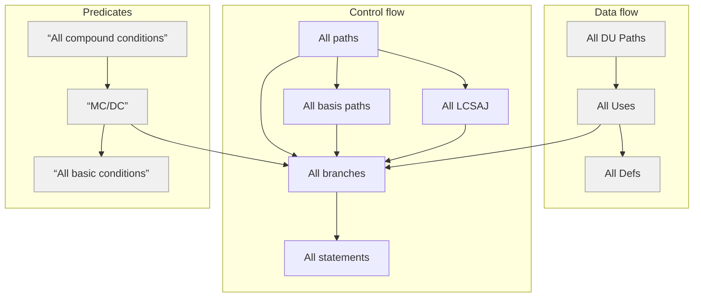
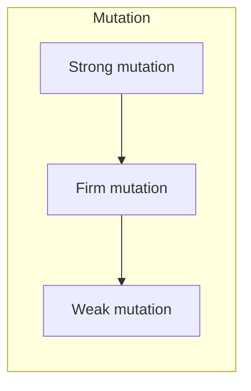

# Code Coverage

## Overview



and Mutation Coverage




## Statement Coverage

Definition
Each statement (or node in a CFG) must be executed at least once
Rationale: 
A defect in a statement can only be revealed by executing it
Measure 
C↓Statement=#Executed/#Statements  
Advantages – Simplicity 
Disadvantages – Weak. Insensitive to the execution path

### Example

```pseudo
input (A)

X=0
If A <5 then x = 4
y=z/x
```

Test A = 2

• All tests succeeded
All statements executed
100% statement coverage
does not imply the program is
free of faults
• The test suite fails to detect
the fault triggered by

Note: show CFG and highligt execution paths

### Discussion

Also known as: line coverage, segment coverage, C0/C1 and basic block coverage. Basic block coverage is the same as statement coverage except the unit of code measured is each sequence of non-branching statements.

Every statement present within the system represents some functionality in the real world that the development process (Requirements Process, Design Process, Coding Process, etc.) felt the system had to provide. If statements are left uncovered by the requirements-based verification process, then that process failed to consider some aspect(s) of the systems implemented functionality. Statement coverage ensures that the verification process has considered sufficient operational scenarios to execute every statement in at least one operational context.

Clearly there’s a problem if X>=5


## Branch Coverage

Definition
Each branch of a decision (or equivalently each edge in a program’s CFG) must be traversed at least once
Subsumes statement coverage criterion because traversing all edges implies traversing all nodes
Rationale
Control statements encompass  “null statements” that are not accounted for in statement coverage

Advantages 
Simplicity 
Problems that were not detected under statement coverage will manifest under branch coverage 
Disadvantage 
Might not detect problems in compound predicates 
Might not detect path dependency problems 

Also known as: branch coverage, all-edges coverage [Roper1994 p.58], basis path coverage [Roper1994 p.48],
C2 [Beizer1990 p.75], decision-decision-path testing [Roper1994 p.39]. "Basis path" testing selects paths that achieve decision coverage.

Every decision present within the system represents a situation in the real world that the development process felt had to be handled specially. This is because each decision partitions (divides) the real world (operational space) into two special cases, one to be handled one way and the other to be handled differently.
If branches (decision outcomes) are left uncovered by the requirements-based verification process, then that process failed to consider the special cases the development process thought were important. Decision coverage ensures that the verification process has considered sufficient operational scenarios to execute every special case the system was designed for in at least one operational context.

### Example 1 

100% Branch coverage reveals the fault in the previous example.

```pseudo
input (A)

X=0
If A <5 then x = 4
y=z/x
```

Test suite A=2
The test suite fails to achieve 100% branch coverage.
Fault is not detected


Test suite A=2 and A=6
The test suite achieve 100% branch coverage.
Fault is detected for test case A>=5

Note: show CFG and highligt execution paths

### Example 2

100% branch coverage does not guaranty that all decision (branch) faults are caught.

Here is an example.

Required behaviour.

A	B	Result
F	F	0
F	T	1
T	F	2
T	T	2


Implemented behaviour.

input (A,B)
Z=0
If A then
2=Z+1
endif
If B then
2= 2
endif
print(Z)


Test suite (A=T,B=T), (A=F;B=F) 
100% branch coverage without exposing the error

Note: show CFG and highligt execution paths


## All path coverage

Definition
Requires that the test suite forces the execution of all feasible paths from the program’s entry to its exit
Advantages
Exhaustive testing
Disadvantages
Number of test cases required. For example 2^n for n predicates.
Every time a single condition is added the number of paths doubles
Without constraints this is mostly a theoretical construction. Constraints include (non-exhaustive list): All statements, All basis paths, All LCSAJ, All DU pairs, All uses and All defs pairs


## Unfeasible Paths

It isn’t always possible to traverse all topological paths due to semantic dependencies not captured in the control flow graph so it might be impossible to achieve 100% path coverage.


Sometimes, it is not possible to test a complete basis set of paths through the control flow graph of a module. This happens when some paths through the module can not be exercised by any input data. For example, if the module makes the same exact decision twice in sequence, no input data will cause it to vary the first decision outcome while leaving the second constant or vice versa. Can somebody give an example? This happens because the control flow graph does not contain semantic information. When this happens McCabe recommends either to remove the dependency (at a risk of the program becoming unstructured) or to relax the criteria to include only the feasible paths.

Realizable complexity 

The realizable complexity, rc, is the maximum possible actual complexity, i.e., the rank of the set of the paths induced by all possible tests. This is similar to the characterization of cyclomatic complexity as the rank of the set of all possible paths, except that some paths may not be induced by any test. In the “classify” example, rc is 3 whereas v(G) is 4. Although rc is an objective and well-defined metric, it may be hard to calculate. In fact, calculating rc is theoretically undecidable (HOPCROFT), since, if it were possible to calculate rc, it would also be possible to determine whether rc is at least 1, which would indicate whether at least one complete path could be executed, which is equivalent to the module halting on some input.


## More too see

Basis Path - reducing number of cases (n+1, n is number of predicates) for thourough testing
Multiple condition coverage and MCDC
Linear Code Sequence and Jump (LCSAJ) coverage
Mutation coverage
Definition Use coverage


