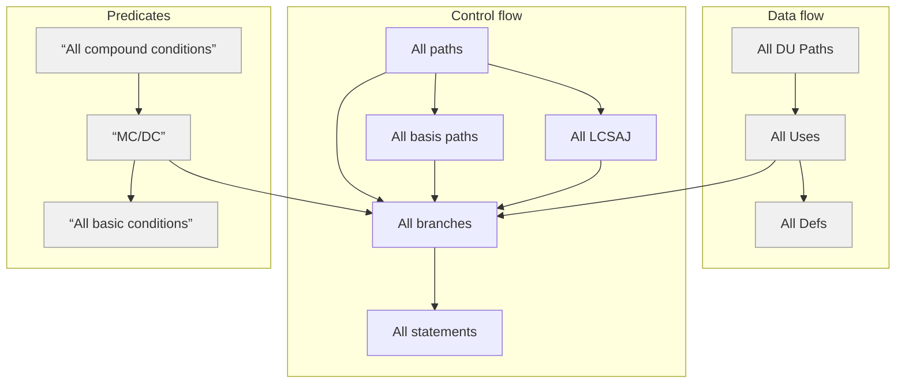
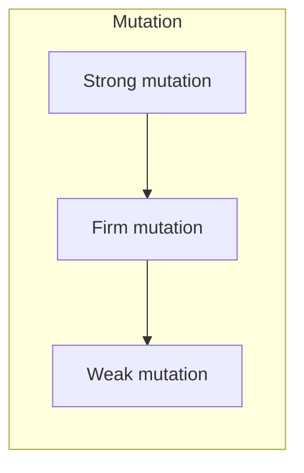

# Code Coverage

```mermaid
flowchart TD

  %% Data flow region
  subgraph DF["Data flow"]
    direction TB
    DU["All DU Paths"]
    Uses["All Uses"]
    Defs["All Defs"]
    DU --> Uses --> Defs
  end


  %% Control flow region
  subgraph CF["Control flow"]
    direction TB
    Paths["All paths"]
    Basis["All basis paths"]
    LCSAJ["All LCSAJ"]
    Branches["All branches"]
    Stmts["All statements"]
    Paths --> Basis
    Paths --> LCSAJ
    Paths --> Branches
    Basis --> Branches
    LCSAJ --> Branches
    Branches --> Stmts
  end

  %% Predicates region
  subgraph PRED["Predicates"]
    direction TB
    Comp[“All compound conditions”]
    MCDC[“MC/DC”]
    Basic[“All basic conditions”]
    Comp --> MCDC --> Basic
    MCDC --> Branches
  end

  %% Cross-links
  Uses --> Branches

  %% Styling shaded nodes
  style DU fill:#f0f0f0,stroke:#999
  style Uses fill:#f0f0f0,stroke:#999
  style Defs fill:#f0f0f0,stroke:#999
  style Comp fill:#f0f0f0,stroke:#999
  style MCDC fill:#f0f0f0,stroke:#999
  style Basic fill:#f0f0f0,stroke:#999

```

```mermaid
flowchart TD

%% Mutation testing region
  subgraph MUT["Mutation"]
    direction TB
    Strong["Strong mutation"]
    Firm["Firm mutation"]
    Weak["Weak mutation"]
    Strong --> Firm --> Weak
  end
```

