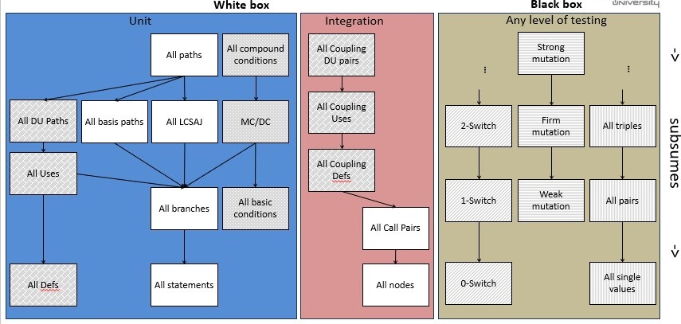
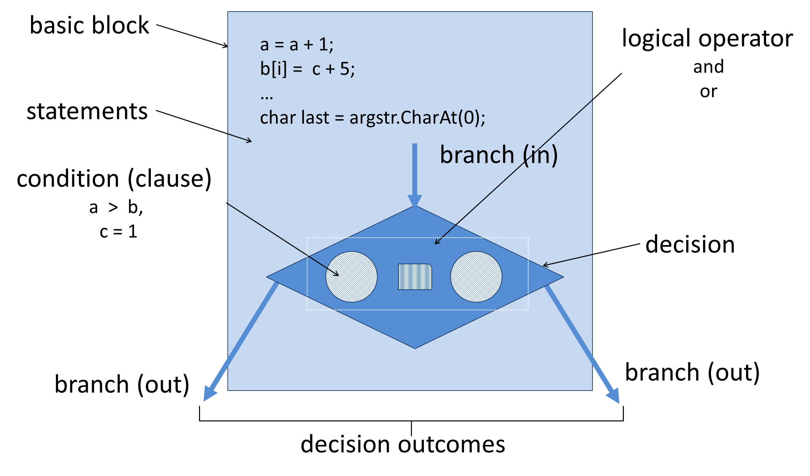

# Adequacy Criteria & Coverage

In software testing, **coverage** and **adequacy criteria** help us measure how thoroughly a test suite exercises an application. Under the assumption that more thorough testing uncovers more faults, we use these metrics to guide test planning, execution, and assess when to stop.

---

## 1. What Is Coverage?

> **Coverage** is a quantitative measure of how much of a particular artifact (code, inputs, requirements, etc.) has been exercised by tests.

* A higher coverage percentage generally (but not always) indicates a lower chance of undiscovered bugs.
* **Pitfall:** Running many tests that all cover the same code or scenarios yields little additional value.

---

## 2. Adequacy Criteria

An **adequacy criterion** defines *what* must be achieved by a test suite. It is often used to:

1. **Generate** test cases (by targeting untested elements).
2. **Measure** existing tests (by computing what percentage of the criterion is covered).
3. **Stop** testing (once a target coverage level or budget is reached).

---

## 3. White-Box (Structural) Coverage Criteria

These criteria examine the *internal* code structure to ensure different parts of the source have been exercised:

| Criterion                        | Description                                                              |
| -------------------------------- | ------------------------------------------------------------------------ |
| **Statement Coverage**           | Every executable statement is run at least once.                         |
| **Branch Coverage**              | Every branch (true/false path) of each control statement is taken.       |
| **Basis-Path Coverage**          | All independent paths through the control-flow graph are exercised.      |
| **Definition-Use (DU) Coverage** | For each variable definition, every corresponding use is tested.         |
| **Mutation Coverage**            | All injected faults (“mutants”) are detected (killed) by the test suite. |

> **Mutation testing** subdivides into:
>
> * **Strong mutation**: Test must cause different final output than original.
> * **Firm mutation**: Test must change some internal state.
> * **Weak mutation**: Test must detect the mutant immediately after the mutated statement.

---

## 4. Black-Box (Specification-Based) Coverage Criteria

These criteria focus on the *external* behavior of the system as defined by requirements or specifications:

| Criterion                              | Description                                                                  |
| -------------------------------------- | ---------------------------------------------------------------------------- |
| **All Combinations of *n* Parameters** | Every unique combination of *n* input parameters is tested (often pairwise). |
| **N-Switch Coverage**                  | All sequences of *n* events, inputs, or states are exercised.                |
| **Equivalence Partitioning**           | Each equivalence class of inputs (assumed to behave the same) is tested.     |
| **Boundary Value Analysis**            | Inputs at or near the edges of valid ranges are tested.                      |
| **State-Based Coverage**               | All relevant state transitions in a state machine are tested.                |
| **Negative Testing**                   | Invalid or unexpected inputs to verify graceful failure.                     |

---

## 5. Applying Coverage Beyond Testing

Coverage metrics can be applied to any verification activity or artifact, for example:

* **Source code**: statement, branch, path coverage
* **Input space**: grammar-based or combinatorial coverage
* **Requirements**: which requirements have associated test cases
* **Test models**: coverage of use-case or sequence-diagram elements
* **GUI**: coverage of screens, buttons, and user flows
* **Exploratory testing**: session-based charters covered

> Even **exploratory testing** can be assessed by logging which areas (code, features, or scenarios) were explored.

---

## 6. How Coverage Is Used in Practice

1. **Test-case generation**

   * *Research approach*: Automatically generate inputs to satisfy coverage criteria.
   * *Industry approach*: Manually or semi-automatically create tests, then measure coverage to find gaps.

2. **Progress tracking and stopping rule**

   * Decide to stop when a target coverage level (e.g., 80% statement, 70% branch) or budget/time limit is reached.

3. **Risk management**

   * Low coverage in critical modules or requirements highlights areas needing more focus.

---

## 🔑 Key Takeaways

* **Coverage ≠ Quality**, but it’s a useful proxy: higher coverage usually correlates with finding more bugs.
* **Balance** structural and specification-based criteria to cover both *how* the code works and *what* it should do.
* Use coverage metrics to **guide**, **measure**, and **justify** your testing effort—not as the sole goal.

---

---

## Non-exhaustive list of adequacy criteria

LCSAJ – Linear Code Sequence and Jump
MC/DC – Modified Condition/Decision Coverage
DU – Definition Use pairs

Only in the case where we keep other things unchanged adequacy/coverage will measure test effectiveness. In general adequacy/coverage are a measure of the thoroughness of the testing.

A criterion C1 includes (or subsumes) the criterion C2 if for every program P and its specification S, any set of test cases that satisfy C1 also satisfy C2. This relation is represented as C1=> C2, and is a transitive  relation. 

One may think that if C1 => C2, testing based on C1 will always be better than testing based on C2. This is not the case because the fault-detection capability of a set of test cases T that satisfy a criterion C depends on the actual test cases in T and not just C (i.e., the criterion is not valid). In other words, if Ti and T2 both  satisfy C for a program does not imply that T1 and T2 will execute the same paths of P and detect the same faults in P. Because the actual test cases also play a role in whether or not an error in a program is detected, in general, it is possible to have a situation where Ci => C2, Ti satisfies Ci, T2 satisfies C2, but T2 detects an error that Ti does not. However, if similar methods are used for test case generation then, generally speaking, Ci will be better for testing than C2 if Ci =^ C2.

## Adequacy criteria selection

Purpose of the testing activity
Source code availability and relevance
Targeted faults (underlying fault model)
Compliance requirements

## Criteria hierarchy

In general, the higher in the hierarchy the criteria, the more thorough the testing. 
It is possible however, to have a situation where Ci subsumes Cj, Ti satisfies Ci, Tj satisfies Cj, but Tj detects an error that Ti does not

### Example

Criteria i : Branch coverage
Test suite i : a = 0; a = 2

Criteria j : Statement coverage
Test suite j : a = 1

## Terminology

### Decisions, conditions & branches

*(Adapted from A. Hass, Guide to Advanced Software Testing, 2008)*

The first concept is that of a statement. An executable statement is defined as a non-comment or nonwhite space entity in a programming language, typically the smallest indivisible unit of execution.

A group of statements always executed together—or not at all—is called a basic block. A basic block can consist of only one statement or it can consist of many. There is no theoretical upper limit for the number of statements in a basic block.

The last statement in a basic block will always be a statement that leads to another building block, or stops the execution of the component we are working with (e.g., return) or the entire software system (end).

The most interesting is, however, when a basic block ends in a decision, that is a statement where the further flow depends on the outcome of the decision.
Decision statements are for example IF … THEN …ELSE, FOR …, DO WHILE…, and CASE OF…. A decision statement is also called a branch point. A branch is a (virtual) connection between basic blocks. One or more branches will lead into a basic block (except to the first), and likewise there will be one or more branches leading out of a basic block (except the last).
The branches out of a basic block are connected to the outcomes of the decision, also called decision outcome or branch outcome. Most decisions have two outcomes (True or False), but some have more, for example Case statements.
The last concept is that of a condition. A condition is a logical expression that can be evaluated to either True or False. A decision may consist of one simple condition, or a number of combined conditions.

### Control flow graphs

Nodes correspond to statements or a block of statements
Edges model transfer of control (i.e. what is the next statement to be executed) within the program
Nodes with two or more output edges are decisions

A path through the software is a sequence of instructions or statements that starts at an entry, junction, or decision and ends at another, or possibly the same, junction, decision, or exit. A path may go through several junctions, processes, or decisions, one or more times. 

Often the first step in understanding the control flow of a program under test is to derive its control-flow graph (CFG). A control-flow graph is a connected directed graph composed of a set of nodes N and a set of edges E. The set of nodes will be regarded as containing two special nodes: a unique start-node and a unique end-node. Each node represents an individual statement in the program and each edge Z(ni, nj) represents a transfer of control flow from node ni to node nj. However, a more compact CFG can be constructed, without loss of relevant information, by partitioning the statements into basic blocks. A basic block is simply a sequence of one or more contiguous, executable statements such that the sequence has only one entry point (the first statement in the block), only one exit point (the last statement in the block), and no statement other than the last can give rise to branching of control flow. In this equivalent, but more compact CFG, each node represents a basic block rather than an individual statement and the edges are the possible control flow connections between the basic blocks.

#### Example

### Data flow criteria and data flow testing

Intuition:  Statements interact through data flow

The assumption behind data flow testing is that to test a program adequately, we should focus on the flows of data values:
A value computed in one statement is used in another
The computation of a bad value is only revealed when it is used
Data flow testing consists of the identification of relevant Definition Use pairs and the design of test cases that force the execution of the program thru them
As an adequacy criteria the number of paths satisfying the criteria (All DUs, All DEFs, All USEs) is counted and compared to the number of paths actually traversed as result of executing the test suite
Data flow testing should not be confused with data flow analysis which concerns itself with the avoidance of data anomalies, e.g. using an undefined variable, but not with the correctness of the computations

## References

*(Adapted from A. Hass, Guide to Advanced Software Testing, 2008)*

