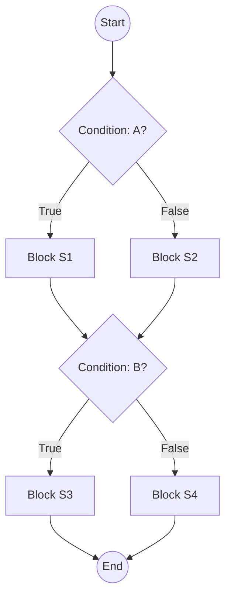

# Terminology

## Decisions, Conditions & Branches

*(Adapted from A. Hass, Guide to Advanced Software Testing, 2008) *

{: .warning }
to be converted in mermaid

1. **Statement**

   * The smallest executable unit in code (non-comment, non-whitespace).
   * Example: `x = y + 1` or `return z;`.

2. **Basic Block**

   * A **sequence** of one or more statements that always execute together.
   * **Entry** at the first statement; **exit** at the last.
   * No internal branches—only the last statement can transfer control elsewhere.

3. **Decision (Branch Point)**

   * A statement whose outcome (True/False or multiple cases) determines the next basic block.
   * Examples:

     * `IF … THEN … ELSE`
     * `FOR …`, `WHILE …`, `DO … WHILE`
     * `CASE … OF`

4. **Branch**

   * A directed edge in the control-flow graph representing one possible outcome of a decision.
   * Each decision can have two or more branches (e.g., True/False or multiple CASE labels).

5. **Condition**

   * A Boolean expression evaluated inside a decision (e.g., `A > B`).
   * Decisions may combine several conditions with logical operators (`&&`, `||`).

---

## Control-Flow Graphs (CFG)

A **control-flow graph** models all possible execution paths through a program:

* **Nodes**

  * Represent either individual statements or basic blocks.
* **Edges**

  * Represent possible transfers of control (which statement/block follows).

**Key properties:**

* There is a unique **start node** and **end node**.
* Nodes with **multiple outgoing edges** are decision points.
* A **path** is any sequence of nodes and edges from start to end (or between any two nodes).

> **Why CFGs matter:**
>
> * They provide the foundation for **structural testing** (statement, branch, path coverage).
> * They help identify all decision points and possible execution paths.

---

### Compact CFG via Basic Blocks

Instead of one node per statement, we can merge consecutive non-branching statements into a **basic-block node**:

1. **Partition** the code into basic blocks.
2. Build a graph where each node is a block, and edges represent jumps between blocks.
3. This yields a **smaller** but **equivalent** CFG for analysis and coverage metrics.

---

### Execution PATH

{: .warning }
todo

## Example: Simple IF/ELSE CFG

{: .warning }
test suite, test case, execution path

---

# Data-Flow Criteria & Data-Flow Testing

---

## Intuition

* **Statements** are connected by the **flow of data**.
* A value **defined** (computed) in one statement is **used** in another.
* Errors often occur when a **bad value** is passed along and then used.

---

## Definition-Use (DU) Testing

1. **Identify** all Definition-Use pairs:

   * **Definition (def):** A statement that assigns a value to a variable.
   * **Use:** A statement that reads that variable’s value.

2. **Design tests** so that each def–use pair is **exercised** (i.e., the program executes a path from the definition to that use).

3. **Measure adequacy** by comparing:

   * **Total DU pairs** in the code
   * **DU pairs covered** by the test suite

---

## Common Data-Flow Coverage Levels

| Criterion           | Description                                                    |
| ------------------- | -------------------------------------------------------------- |
| **All DU Paths**    | Every path from a definition to a use of a variable is tested. |
| **All DU Pairs**    | Every def–use pair is covered at least once.                   |
| **All Definitions** | Each variable definition is exercised.                         |
| **All Uses**        | Each use of a defined variable is exercised.                   |

> **Note:** Data-flow testing focuses on **correctness of computation**, while data-flow **analysis** detects anomalies like using an uninitialized variable.

---

### Why Data-Flow Testing?

* Catches errors that **structural (white-box) tests** might miss—especially those involving the **interaction** of variables.
* Complements **control-flow** criteria by ensuring not just that branches are taken, but that **data values** flow correctly through the code.

---

### References


