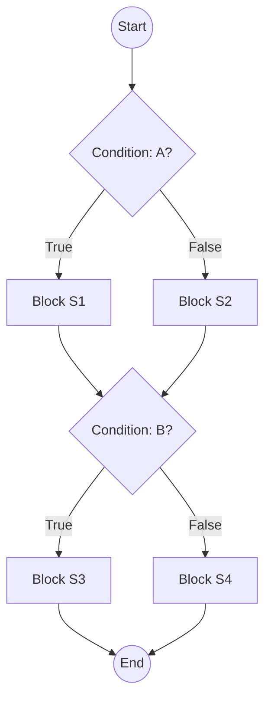

## Terminology

### Decisions, conditions & branches

*(Adapted from A. Hass, Guide to Advanced Software Testing, 2008)*

The first concept is that of a statement. An executable statement is defined as a non-comment or nonwhite space entity in a programming language, typically the smallest indivisible unit of execution.

A group of statements always executed together—or not at all—is called a basic block. A basic block can consist of only one statement or it can consist of many. There is no theoretical upper limit for the number of statements in a basic block.

The last statement in a basic block will always be a statement that leads to another building block, or stops the execution of the component we are working with (e.g., return) or the entire software system (end).

The most interesting is, however, when a basic block ends in a decision, that is a statement where the further flow depends on the outcome of the decision.
Decision statements are for example IF … THEN …ELSE, FOR …, DO WHILE…, and CASE OF…. A decision statement is also called a branch point. A branch is a (virtual) connection between basic blocks. One or more branches will lead into a basic block (except to the first), and likewise there will be one or more branches leading out of a basic block (except the last).
The branches out of a basic block are connected to the outcomes of the decision, also called decision outcome or branch outcome. Most decisions have two outcomes (True or False), but some have more, for example Case statements.
The last concept is that of a condition. A condition is a logical expression that can be evaluated to either True or False. A decision may consist of one simple condition, or a number of combined conditions.

### Control flow graphs

Nodes correspond to statements or a block of statements
Edges model transfer of control (i.e. what is the next statement to be executed) within the program
Nodes with two or more output edges are decisions

A path through the software is a sequence of instructions or statements that starts at an entry, junction, or decision and ends at another, or possibly the same, junction, decision, or exit. A path may go through several junctions, processes, or decisions, one or more times. 

Often the first step in understanding the control flow of a program under test is to derive its control-flow graph (CFG). A control-flow graph is a connected directed graph composed of a set of nodes N and a set of edges E. The set of nodes will be regarded as containing two special nodes: a unique start-node and a unique end-node. Each node represents an individual statement in the program and each edge Z(ni, nj) represents a transfer of control flow from node ni to node nj. However, a more compact CFG can be constructed, without loss of relevant information, by partitioning the statements into basic blocks. A basic block is simply a sequence of one or more contiguous, executable statements such that the sequence has only one entry point (the first statement in the block), only one exit point (the last statement in the block), and no statement other than the last can give rise to branching of control flow. In this equivalent, but more compact CFG, each node represents a basic block rather than an individual statement and the edges are the possible control flow connections between the basic blocks.

#### Example

### Data flow criteria and data flow testing

Intuition:  Statements interact through data flow

The assumption behind data flow testing is that to test a program adequately, we should focus on the flows of data values:
A value computed in one statement is used in another
The computation of a bad value is only revealed when it is used
Data flow testing consists of the identification of relevant Definition Use pairs and the design of test cases that force the execution of the program thru them
As an adequacy criteria the number of paths satisfying the criteria (All DUs, All DEFs, All USEs) is counted and compared to the number of paths actually traversed as result of executing the test suite
Data flow testing should not be confused with data flow analysis which concerns itself with the avoidance of data anomalies, e.g. using an undefined variable, but not with the correctness of the computations

## References

*(Adapted from A. Hass, Guide to Advanced Software Testing, 2008)*

# Terminology

---

## Decisions, Conditions & Branches

*(Adapted from A. Hass, *Guide to Advanced Software Testing*, 2008) *

1. **Statement**

   * The smallest executable unit in code (non-comment, non-whitespace).
   * Example: `x = y + 1` or `return z;`.

2. **Basic Block**

   * A **sequence** of one or more statements that always execute together.
   * **Entry** at the first statement; **exit** at the last.
   * No internal branches—only the last statement can transfer control elsewhere.

3. **Decision (Branch Point)**

   * A statement whose outcome (True/False or multiple cases) determines the next basic block.
   * Examples:

     * `IF … THEN … ELSE`
     * `FOR …`, `WHILE …`, `DO … WHILE`
     * `CASE … OF`

4. **Branch**

   * A directed edge in the control-flow graph representing one possible outcome of a decision.
   * Each decision can have two or more branches (e.g., True/False or multiple CASE labels).

5. **Condition**

   * A Boolean expression evaluated inside a decision (e.g., `A > B`).
   * Decisions may combine several conditions with logical operators (`&&`, `||`).

---

## Control-Flow Graphs (CFG)

A **control-flow graph** models all possible execution paths through a program:

* **Nodes**

  * Represent either individual statements or basic blocks.
* **Edges**

  * Represent possible transfers of control (which statement/block follows).

**Key properties:**

* There is a unique **start node** and **end node**.
* Nodes with **multiple outgoing edges** are decision points.
* A **path** is any sequence of nodes and edges from start to end (or between any two nodes).

> **Why CFGs matter:**
>
> * They provide the foundation for **structural testing** (statement, branch, path coverage).
> * They help identify all decision points and possible execution paths.

---

### Compact CFG via Basic Blocks

Instead of one node per statement, we can merge consecutive non-branching statements into a **basic-block node**:

1. **Partition** the code into basic blocks.
2. Build a graph where each node is a block, and edges represent jumps between blocks.
3. This yields a **smaller** but **equivalent** CFG for analysis and coverage metrics.

---

## Example: Simple IF/ELSE CFG

---

# Data-Flow Criteria & Data-Flow Testing

---

## Intuition

* **Statements** are connected by the **flow of data**.
* A value **defined** (computed) in one statement is **used** in another.
* Errors often occur when a **bad value** is passed along and then used.

---

## Definition-Use (DU) Testing

1. **Identify** all Definition-Use pairs:

   * **Definition (def):** A statement that assigns a value to a variable.
   * **Use:** A statement that reads that variable’s value.

2. **Design tests** so that each def–use pair is **exercised** (i.e., the program executes a path from the definition to that use).

3. **Measure adequacy** by comparing:

   * **Total DU pairs** in the code
   * **DU pairs covered** by the test suite

---

## Common Data-Flow Coverage Levels

| Criterion           | Description                                                    |
| ------------------- | -------------------------------------------------------------- |
| **All DU Paths**    | Every path from a definition to a use of a variable is tested. |
| **All DU Pairs**    | Every def–use pair is covered at least once.                   |
| **All Definitions** | Each variable definition is exercised.                         |
| **All Uses**        | Each use of a defined variable is exercised.                   |

> **Note:** Data-flow testing focuses on **correctness of computation**, while data-flow **analysis** detects anomalies like using an uninitialized variable.

---

### Why Data-Flow Testing?

* Catches errors that **structural (white-box) tests** might miss—especially those involving the **interaction** of variables.
* Complements **control-flow** criteria by ensuring not just that branches are taken, but that **data values** flow correctly through the code.

---

### References


