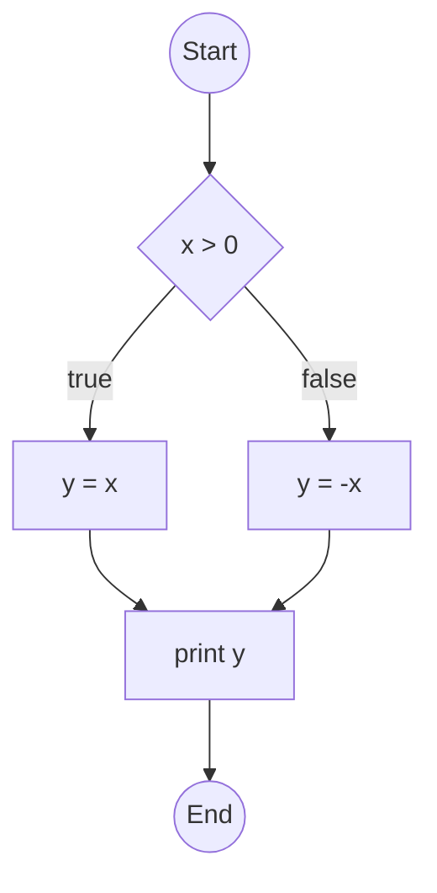
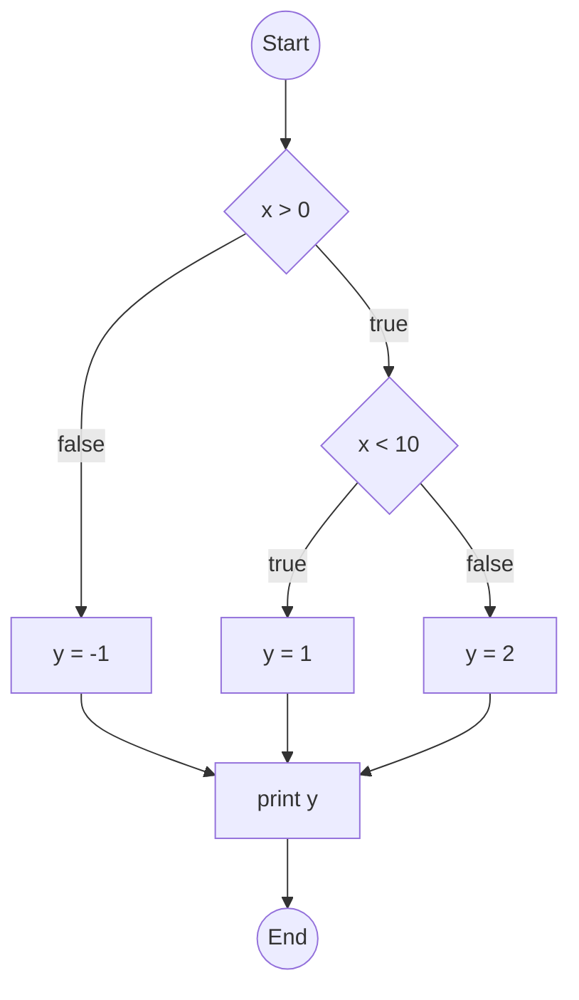
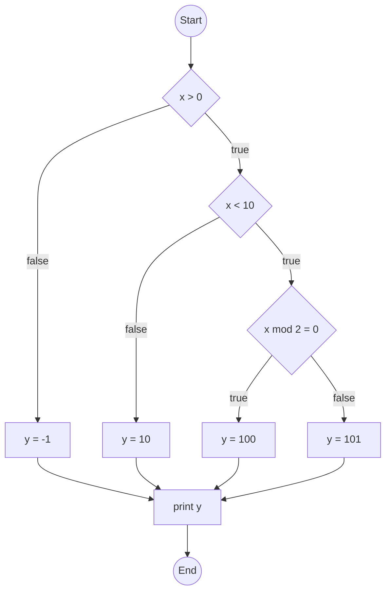

# Basis Path Coverage

Great! Here's a continuation of your study notes, formatted in the same clear, structured, and educational style. The new sections cover:

* Basis Path Coverage
* Modified Condition/Decision Coverage (MC/DC)
* Mutation Coverage
* Combinatorial Coverage

---

## Basis Path Coverage

### Definition

Basis path coverage is a white-box testing technique that uses the program’s **control flow graph (CFG)** to identify a set of **linearly independent paths**.
The goal is to execute each of these paths at least once.

The number of basis paths is determined by **cyclomatic complexity**:

$$
V(G) = E - N + 2P
$$

Where:

- $$E$$: Number of edges in the CFG
- $$N$$: Number of nodes
- $$P$$: Number of connected components (usually 1 for a single function/module)


Alternativly, in simple cases, we may use:

$$
V(G) = n+1
$$

Where:

- $$n$$: Number of predicates (e.g. IFs, WHILE, FOR, etc.)

### Advantages

* Ensures thorough testing with relatively few test cases
* Subsumes statement and branch coverage

### Disadvantages

* Can be hard to identify basis paths manually
* Assumes all paths are feasible (some may not be)


### Discussion

* Basis path testing uses **cyclomatic complexity** to define the number of **linearly independent paths** through a control flow graph (CFG).
* It ensures that **each edge** in the graph is exercised at least once, but **not necessarily every possible path**.
* Compared to **All Path Coverage**, it's much more **scalable**.

---

### Example 1 – One Decision Point

```fortran
input(x)

if x > 0 then
   y = x
else
   y = -x
end if

print(y)
```

**CFG:**



**Cyclomatic Complexity:**

$$
V(G) = 6 - 6 + 2 = 2
$$

same with

$$
V(G) = 1+1 = 2
$$

**Basis Paths:**

1. `Start → D1(true) → S1 → P → End`
2. `Start → D1(false) → S2 → P → End`
   (3rd path is linear combination but typically not separately tested)

✅ 2 test cases suffice (e.g., `x = 1` and `x = -1`)

---

### Example 2 – Two Decision Points

```fortran
input(x)

if x > 0 then
   if x < 10 then
      y = 1
   else
      y = 2
   end if
else
   y = -1
end if

print(y)
```

**CFG:**



**Cyclomatic Complexity:**

$$
V(G) = 8 - 7 + 2 = 3
$$

same with

$$
V(G) = 2+1 = 3
$$

**Basis Paths:**

1. `x > 0`, `x < 10` ⇒ `Start → D1(true) → D2(true) → S1 → P → End`
2. `x > 0`, `x ≥ 10` ⇒ `Start → D1(true) → D2(false) → S2 → P → End`
3. `x ≤ 0` ⇒ `Start → D1(false) → S3 → P → End`

✅ 3 test cases needed (e.g., `x = 5`, `x = 15`, `x = -2`)

---

### Example 3 – Three Decision Points

```fortran
input(x)

if x > 0 then
   if x < 10 then
      if x mod 2 = 0 then
         y = 100
      else
         y = 101
      end if
   else
      y = 10
   end if
else
   y = -1
end if

print(y)
```

**CFG:**



**Cyclomatic Complexity:**

$$
V(G) = 12 - 10 + 2 = 4
$$

same with

$$
V(G) = 3+1 = 4
$$

**Basis Paths:**

1. `x > 0`, `x < 10`, `x mod 2 = 0`
2. `x > 0`, `x < 10`, `x mod 2 ≠ 0`
3. `x > 0`, `x ≥ 10`
4. `x ≤ 0`

✅ Only 4 test cases required (e.g., `x = 4`, `x = 5`, `x = 15`, `x = -1`)

---

### Comparison: Basis Path vs All Path Coverage

| Property            | Basis Path Coverage                           | All Path Coverage                                            |
| ------------------- | --------------------------------------------- | ------------------------------------------------------------ |
| **# of test cases** | Linear in number of decisions (≤ n+1)         | Exponential: $$2^n$$ for n decisions                           |
| **Goal**            | Cover all **edges** and **independent paths** | Cover **every possible execution path**                      |
| **Feasibility**     | Practical                                     | Often infeasible (many paths may be redundant or untestable) |
| **Redundancy**      | Minimal                                       | High (many paths may test the same logic repeatedly)         |
| **Example (n=3)**   | \~4 tests                                     | 8 tests (if all paths feasible)                              |

So, for **n decision points**, Basis Path typically requires only $$n + 1$$ test cases, while All Path Coverage requires $$2^n$$ — which grows very quickly.


## References

* \[Beizer 1990] Boris Beizer, *Software Testing Techniques*, 2nd ed.
* \[Roper 1994] Marc Roper, *Software Testing*
* \[McCabe] Thomas McCabe, *A Complexity Measure* (1976)
* \[RTCA DO-178C] Software Considerations in Airborne Systems and Equipment Certification


