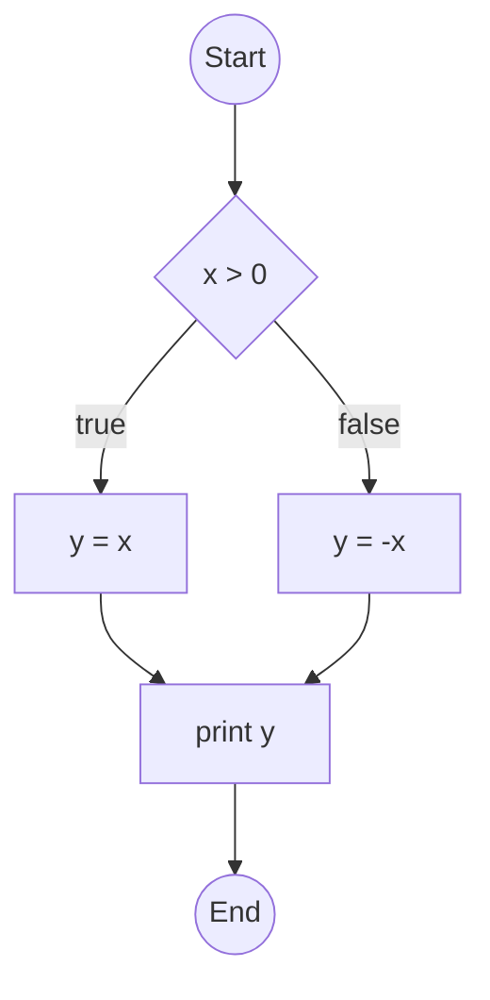
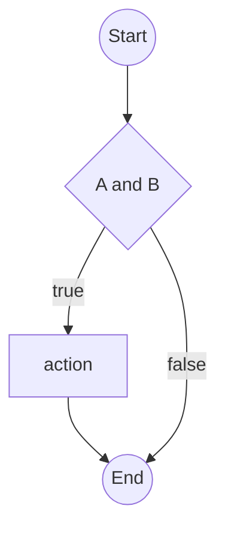
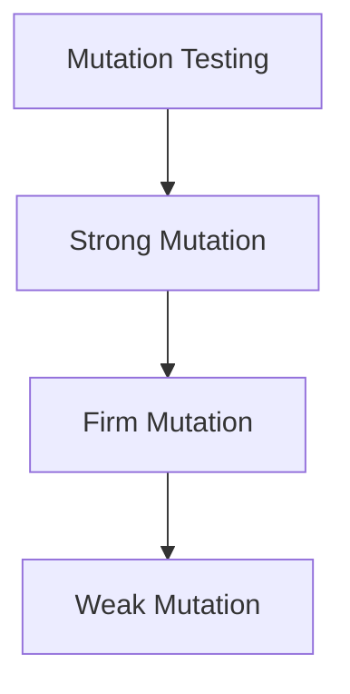

# Basis Path Coverage

Great! Here's a continuation of your study notes, formatted in the same clear, structured, and educational style. The new sections cover:

* Basis Path Coverage
* Modified Condition/Decision Coverage (MC/DC)
* Mutation Coverage
* Combinatorial Coverage

---

## Basis Path Coverage

### Definition

Basis path coverage is a white-box testing technique that uses the program’s **control flow graph (CFG)** to identify a set of **linearly independent paths**.
The goal is to execute each of these paths at least once.

The number of basis paths is determined by **cyclomatic complexity**:

$$
V(G) = E - N + 2P
$$

Where:

* $E$: Number of edges in the CFG
* $N$: Number of nodes
* $P$: Number of connected components (usually 1 for a single function/module)

### Advantages

* Ensures thorough testing with relatively few test cases
* Subsumes statement and branch coverage

### Disadvantages

* Can be hard to identify basis paths manually
* Assumes all paths are feasible (some may not be)

### Example

```pseudo
input(x)

if x > 0 then
   y = x
else
   y = -x
end if

print(y)
```

**CFG:**



**Cyclomatic Complexity:**
$$V(G) = 6 - 5 + 2 = 3$$
⇒ 3 basis paths (1 through true branch, 1 through false, and 1 combination of both paths)

---

## Modified Condition/Decision Coverage (MC/DC)

### Definition

MC/DC requires that:

* Each **condition** in a decision has been shown to **independently affect** the decision's outcome.

Formally:

> Each condition in a decision has been shown to independently affect the outcome of the decision by varying just that condition while holding others constant.

### Motivation

* Stronger than simple branch coverage
* Used in **safety-critical systems** (e.g., aviation, automotive)

### Advantages

* Reveals errors in individual conditions within decisions

### Disadvantages

* Requires careful test case design
* More complex to analyze

### Example

**Decision:**

```pseudo
if (A and B) then
    action
end if
```

To satisfy MC/DC:

* Show that **A** affects the outcome:

  * A = T, B = T → true
  * A = F, B = T → false
* Show that **B** affects the outcome:

  * A = T, B = T → true
  * A = T, B = F → false

**Test suite:**

* (A=T, B=T), (A=F, B=T), (A=T, B=F)
  ✅ Satisfies MC/DC

**CFG:**



---

## Mutation Coverage

### Definition

Mutation testing introduces small changes (mutants) into the code and checks whether the existing test suite detects them.

**Goal:**
Check if test suite can "kill" mutants — i.e., produce different output from the original.

### Types of Mutation



* **Strong Mutation**: Test must cause a mutant to produce different output.
* **Firm Mutation**: Weaker than strong; detection at intermediate state.
* **Weak Mutation**: Only requires the mutant to reach a different internal state.

### Advantages

* Measures fault-detection ability of tests
* Can reveal test suite weaknesses

### Disadvantages

* Computationally expensive
* Mutant generation and analysis are complex

### Example

**Original code:**

```pseudo
if x > 0 then
    y = 1
end if
```

**Mutant:**

```pseudo
if x >= 0 then
    y = 1
end if
```

Test case: `x = 0`
✅ Kills the mutant (original skips, mutant executes)

---

## Combinatorial Coverage

### Definition

Tests combinations of input values or conditions, especially useful when decisions are based on **multiple predicates**.

* **All Combinations**: Every possible combination of inputs is tested (exhaustive).
* **Pairwise Testing**: Every **pair** of input values occurs in at least one test.

### Advantages

* Systematic and covers interactions between inputs
* Reduces number of test cases vs full combination

### Disadvantages

* Full combination is exponential in number of inputs
* Assumes equal importance for all combinations

### Example

Conditions: A, B, C (Boolean)

**All combinations (2³ = 8):**

```text
A B C
-----
F F F
F F T
F T F
F T T
T F F
T F T
T T F
T T T
```

**Pairwise combinations (e.g.):**

```text
A B C
-----
F F F
F T T
T F T
T T F
```

✅ Covers all pairs (A-B, A-C, B-C)

---

## References

* \[Beizer 1990] Boris Beizer, *Software Testing Techniques*, 2nd ed.
* \[Roper 1994] Marc Roper, *Software Testing*
* \[McCabe] Thomas McCabe, *A Complexity Measure* (1976)
* \[RTCA DO-178C] Software Considerations in Airborne Systems and Equipment Certification

---

Would you like illustrations added for LCSAJ, Definition-Use (DU), or path-specific examples next?

