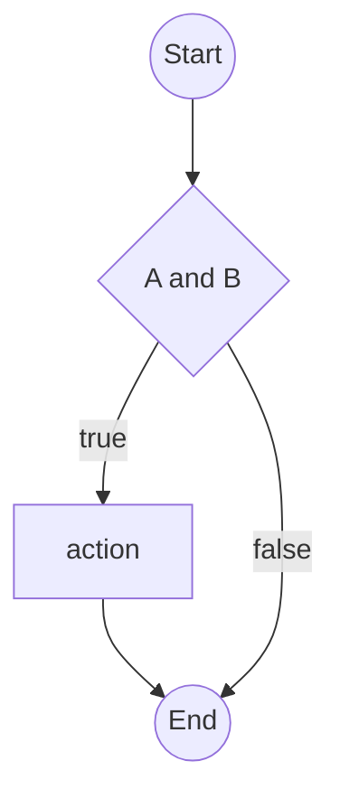

## Modified Condition/Decision Coverage (MC/DC)

### Definition

MC/DC requires that:

* Each **condition** in a decision has been shown to **independently affect** the decision's outcome.

Formally:

> Each condition in a decision has been shown to independently affect the outcome of the decision by varying just that condition while holding others constant.

### Motivation

* Stronger than simple branch coverage
* Used in **safety-critical systems** (e.g., aviation, automotive)

### Advantages

* Reveals errors in individual conditions within decisions

### Disadvantages

* Requires careful test case design
* More complex to analyze

### Example

**Decision:**

```fortran
if (A and B) then
    action
end if
```

To satisfy MC/DC:

* Show that **A** affects the outcome:

  * A = T, B = T → true
  * A = F, B = T → false
* Show that **B** affects the outcome:

  * A = T, B = T → true
  * A = T, B = F → false

**Test suite:**

* (A=T, B=T), (A=F, B=T), (A=T, B=F)
  ✅ Satisfies MC/DC

**CFG:**



---

## References

* \[Beizer 1990] Boris Beizer, *Software Testing Techniques*, 2nd ed.
* \[Roper 1994] Marc Roper, *Software Testing*
* \[McCabe] Thomas McCabe, *A Complexity Measure* (1976)
* \[RTCA DO-178C] Software Considerations in Airborne Systems and Equipment Certification

