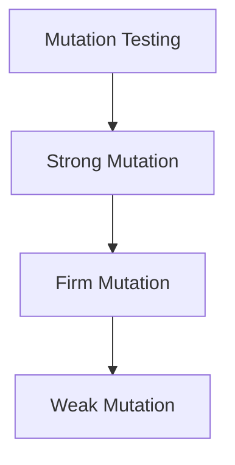

## Mutation Coverage

### Definition

Mutation testing introduces small changes (mutants) into the code and checks whether the existing test suite detects them.

**Goal:**
Check if test suite can "kill" mutants — i.e., produce different output from the original.

### Types of Mutation

{: .warning }
TODO:



* **Strong Mutation**: Test must cause a mutant to produce different output.
* **Firm Mutation**: Weaker than strong; detection at intermediate state.
* **Weak Mutation**: Only requires the mutant to reach a different internal state.

### Advantages

* Measures fault-detection ability of tests
* Can reveal test suite weaknesses

### Disadvantages

* Computationally expensive
* Mutant generation and analysis are complex

### Example

**Original code:**

```fortran
if x > 0 then
    y = 1
end if
```

**Mutant:**

```fortran
if x >= 0 then
    y = 1
end if
```

Test case: `x = 0`
✅ Kills the mutant (original skips, mutant executes)

---

## References

* \[Beizer 1990] Boris Beizer, *Software Testing Techniques*, 2nd ed.
* \[Roper 1994] Marc Roper, *Software Testing*
* \[McCabe] Thomas McCabe, *A Complexity Measure* (1976)
* \[RTCA DO-178C] Software Considerations in Airborne Systems and Equipment Certification
