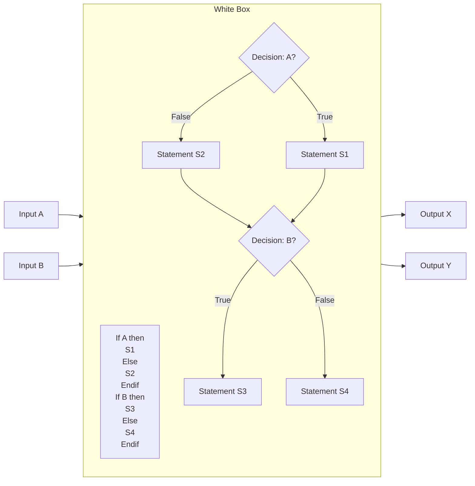
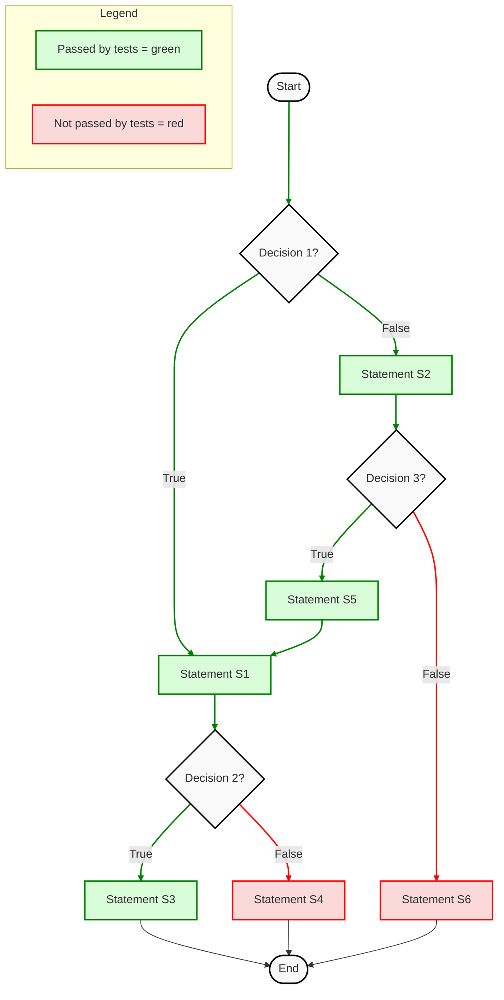
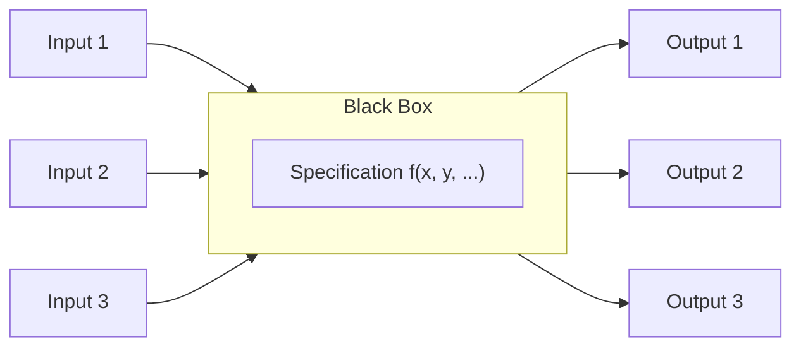

### Purpose-based testing

What things do we want to test? A non-exhaustive list of the software characteristic being tested

Functions. See that each function does what it’s supposed to do and not what it isn’t supposed to do
Look for any data processed by the product. Look at outputs as well as inputs
Decide which particular data to test with. Consider things like boundary values, typical values, convenient values, and invalid values
Consider combinations of data worth testing together

Regression - Re-testing of something that was already working, usually with existing test cases, to provide confidence that the system under test (SUT) still functions correctly following modification or extension of the system (such as user enhancements or upgrades or following new builds or releases of the software)

Scenarios. Test to a compelling story. Do one thing after another
Define test procedures or high level cases that incorporate multiple activities connected end-to-end 
Don’t reset the system between tests. 
Vary timing and ordering of events

Efficiency. Does the system provide appropriate performance, relative to the amount of resources used, under stated conditions

Performance testing
Testing done to evaluate system’s response time, throughput and resource utilization
Performed under “normal” operating conditions

Load testing
Process of exercising the system by feeding it the largest  specified task or workload

Stress testing
Trying to break the system  with the purpose of assuring  that the system fails and recovers gracefully. This testing is performed by overwhelming the system’s resources or by taking them away from it beyond the specified conditions

Robustness Testing. Imagine calamities. The possibilities are endless. How will the system react to them?

### White or black box testing?

#### White box testing

    Tests what is written, not what was intended
    Knowledge of the implementation helps to  include test cases that may not be identified from specifications alone
    Good for discovering additional, perhaps unwanted, functionality, e.g., intrusive or unreachable code
    Can be used to assess precisely what code features remain untested
    On its own, gives no indication of how thoroughly the stated requirements have been tested

##### More about WB
White Box Testing: Looking at the Code

Design test cases such as
    All the code statements have been executed
    Both branches of each condition have been executed
    All linearly independent paths have been traversed

> To stimulate the program we need inputs, how do we choose them? If we base our selection we might miss unspecified behaviors implemented in the program. If we select values based on the structure we might miss required behaviors that were not implemented. If the condition is not satisfied we will analyze the code to see what values must be provided as input to force the execution along the desired path

#### Black box testing

    Good for identifying incorrect or missing implementation of stated requirements 
    Test cases can be written by users and technologist alike
    On its own, gives no indication of how thoroughly the program code has been tested
    Can be used to assess whether any features in the requirements remain untested

##### More about BB

Black box testing: looking at the specification

    Identify the software under test
    Things that the product can do (functions and sub functions).
    Identify relevant test aspects
    Values and other attributes of the data
    Execution conditions
    Design test cases
    Decide which particular data to test with. Consider things like boundary values, typical values, convenient values, invalid values, or best representatives
    Consider combinations of data worth testing together
    Determine how would you’d know a function is working (expected test result) 
    Test each function, one at a time. See that each function:
    Does what it should do AND
    Does not do what it shouldn’t do

### White or black box testing? 

| **White Box Testing**                                                                 | **Black Box Testing**                                                          |
|--------------------------------------------------------------------------------------|-------------------------------------------------------------------------------|
| Tests what is written, not what was intended                                         | Good for identifying incorrect or missing implementation of stated requirements |
| Knowledge of the implementation helps include test cases that may not be identified from specifications alone | Test cases can be written by users and technologists alike                     |
| Good for discovering additional, perhaps unwanted, functionality (e.g., intrusive or unreachable code) | On its own, gives no indication of how thoroughly the program code has been tested |
| Can be used to assess precisely what code features remain untested                   | Can be used to assess whether any features in the requirements remain untested |
| On its own, gives no indication of how thoroughly the stated requirements have been tested |                                                                               |

## More BB techniques

### Exploratory testing: Based on the skill and experience of the testers

Useful…

    If few system specifications are available, but knowledge of the application and the anticipated goal are
    As a supplement to the “scripted” test design techniques

Limitations

    Poor exploration may result in a false sense of coverage and effectiveness
    Lack of repeatability. There is no guarantee that a particular function will be tested in the same way by a different tester

Two approaches

    Ad-hoc
    Session based

### Target fault model

Partition based testing. 

Assumptions about where the faults are most likely located or systematic exploration of the software. Points belonging to a partition are assumed to be “revealing” or equivalents

    Boundary value analysis
    Combinatorial
    Data flow
    States
    Negative testing

Random testing. 

All input points are unique. Effort is put into finding a suitable random distribution

    Random testing
    Fuzz testing

#### Partition testing

A partition is the division of the input domain of the software under test into a number of subsets (called equivalence classes) for which the behavior is assumed to be the same for all values belonging to the each of them

The partition criteria utilized is what differentiates one test design technique from another

> To keep down our testing costs, we don’t want to write several test cases that test the same aspect of our program. A good test case uncovers a different class of errors (e.g., incorrect processing of all character data). Equivalence partitioning is a strategy that can be used to reduce the number of test cases that need to be developed. Equivalence partitioning divides the input domain of a program into classes. For each of these equivalence classes, it is hypothesized that the set of data must be treated the same by the module under test and should then produce likely answers, if it does not then the test fails.

#### Random testing

The systematic variation of values through the input space with the purpose of identifying abnormal output patterns. 
When such patterns are identified a root cause analysis is conducted to identify the source of the problem. In this case the “state 3” outputs seem to be missing

(from. When Only Random Testing Will Do Dick Hamlet, 2006)

> Random testing is a technique which systematically explores the input space of the software under testing. This use of the term random is very different from other disciplines where random testing means selecting a few cases just by “chance”. To be effective and efficient random testing relies on the automatic generation of test inputs. The problem with random testing is how to verify that the results are those expected. This is known as the “oracle problem”.

> The solutions to the oracle problem fall into three categories: the use of a proxy to produce the correct results against the values produced by the new application will be checked. The proxy could be an existing system or a simple computational form. The second category is based on the recognition of patterns. Pattern recognition can take the form of curve fitting algorithms followed by a study of discontinuities in the output of the application or it can be in the form of assertions where a relation between variables is a specified and a violation of the assertion denotes a failure of the software. The breaking of a pattern can also be detected by visual inspection of a summary input like in the example shown. A third category consist in analyzing the states which result after the execution of the software with a certain data. A common example for this is fuzz testing in which the expected output from the test are that after processing the data the software exits normally. The software raises an exception indication an abnormal condition or the software crashes revealing an abnormal situation that it was not programmed to handle.

### Test execution

Manual execution

Automatic execution

    Capture/replay 
    Scripting
    Frameworks (Junit, TestNG)
    Continuous Integration (GitHub Actions, GitLab CI, …)

