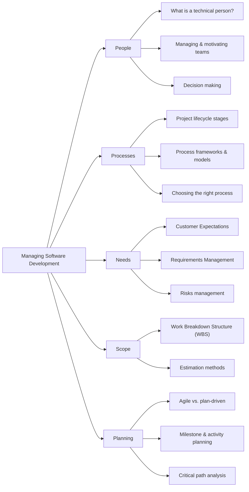

  

# Managing Software Development

Welcome to the course notes repository for **Managing Software Development**.  
This resource provides a comprehensive, practical, and accessible guide to the key topics in the field. Whether you are an MS student, a professional, or simply curious, these notes are designed to support your learning and growth.

---

## Overview

Explore the major areas covered in this course:

---

## Areas Covered

### 1. [People](/content/people/)
Understand what makes technical teams tick:
- What is a "technical person"?
- Managing and motivating teams
- Decision making in software projects

---

### 2. [Processes](/content/proc/)
Learn how to manage the variability of human factors:
- Project lifecycle stages
- Process frameworks and models
- Choosing the right process for your context

---

### 3. [Needs](/content/needs/)
Master the art of managing expectations and risks:
- Understanding customer needs
- Requirements gathering and management
- Risk identification and mitigation

---

### 4. [Scope](/content/scope/)
Define and estimate project boundaries:
- Work Breakdown Structure (WBS)
- Estimation methods for time and effort

---

### 5. [Planning](/content/plan/)
Plan for quality and success:
- Agile vs. plan-driven approaches
- Milestone and activity planning
- Critical path analysis

---

### 6. [Tracking](/content/track/)
Monitor progress and adapt:
- Release planning (Buffered MoSCoW method)
- Tracking and control (Earned Value, etc.)

---

### 7. [Selected Materials](/content/material/)
Access curated resources to deepen your understanding:
- Books
- Research papers
- Guides and online courses

---

## Contributing

We welcome contributions from students, practitioners, and educators!

### How to Contribute

- **Fix content issues**: typos, fact checks, source validation → [See guidelines](https://github.com/msdbok/msdbok.github.io/blob/main/CONTRIBUTING.md)
- **Add method descriptions**: 1-2 page technique descriptions → [Use template](https://github.com/msdbok/msdbok.github.io/blob/main/templates/method-template.md)
- **Write analysis papers**: 3-4 page comparative studies → [Use template](https://github.com/msdbok/msdbok.github.io/blob/main/templates/analysis-template.md)

📖 **[Read full contribution guidelines](https://github.com/msdbok/msdbok.github.io/blob/main/CONTRIBUTING.md)**

---

### Objective

These course notes aim to:
- Provide a structured and accessible overview of Managing Software Development topics.
- Equip readers with insights that bridge theory and real-world application.
- Encourage collaboration and knowledge-sharing within the software development community.

**Approach:**  
- Focus on breadth over depth, introducing a wide range of concepts and practices.
- Present current and leading industry techniques, highlighting their strengths and limitations.
- Emphasize understanding the differences between approaches, rather than immediate mastery.
- Encourage critical thinking:
    - Reason about which techniques to apply in different contexts
    - Justify your choices with clear arguments
    - Explicitly state your assumptions, based on available facts

Our goal is to help you build a foundation for making informed decisions in software development management.

---

## Acknowledgments

Much of the content in this handbook is heavily inspired by and adapted from lectures by **Eduardo Miranda** and **David Root** on software project management at Carnegie Mellon University. The structure, examples, and pedagogical approach throughout the planning, processes, and materials sections reflect their teaching materials and frameworks.

Pages with significant lecture-based content include an **Acknowledgments section** crediting the original instructors, along with proper citations in the **Sources section**. All content pages maintain rigorous attribution practices with full citations for frameworks, methods, and research.

---

Feel free to explore, contribute, and enhance your understanding of software development management!

{: .highlight }
**Disclaimer:** AI is used for text polishing and explaining. Authors have verified all facts and claims. In case of an error, feel free to file an issue.
